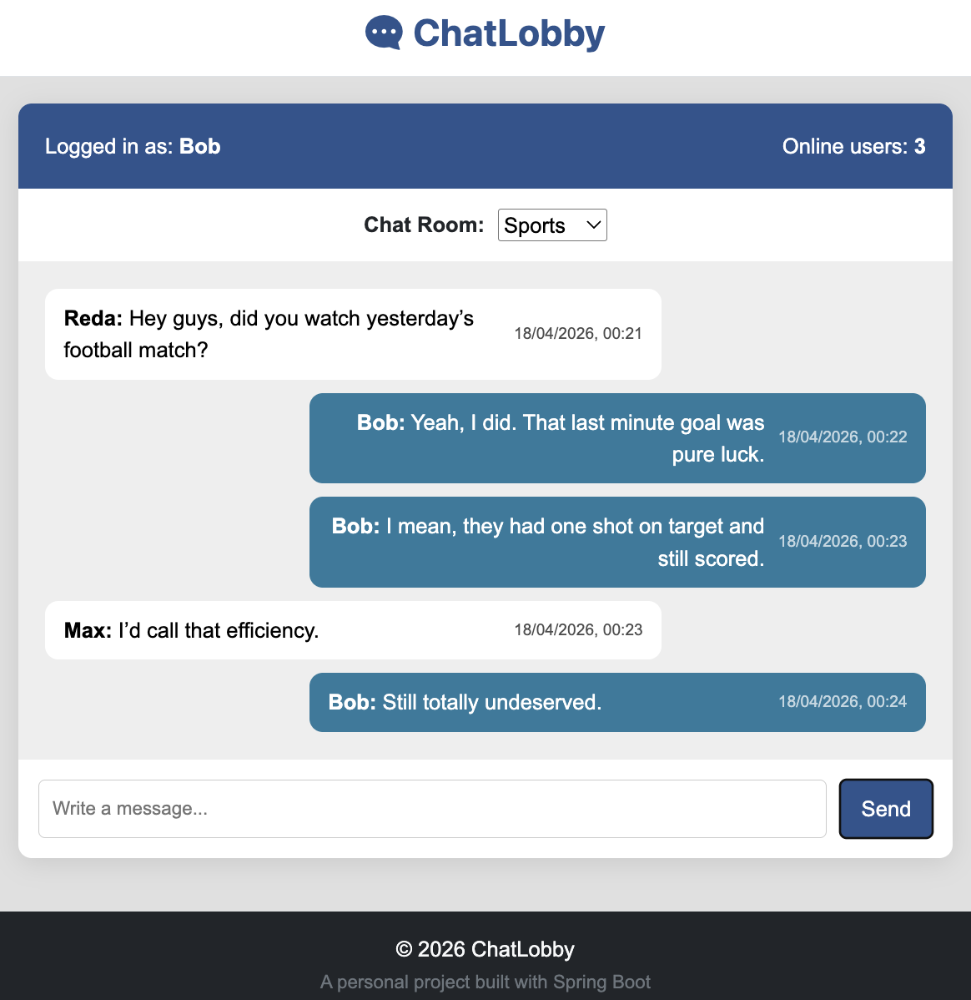

## ChatLobby – Real-Time Chat Application
A simple real-time chat application built with Spring Boot, WebSockets, and PostgreSQL.

## 🌐 Deployment

The application is deployed using:
- **Render** for the backend (Dockerized Spring Boot application)
- **Neon** for the PostgreSQL database (serverless, free tier)

👉 Live URL: https://chatlobby.onrender.com

## Features
- User registration & login with Spring Security.
- Real-time messaging with WebSockets.
- Persistent chat history stored in PostgreSQL.
- Chat rooms for group conversations.

## Interface
<p align="center">
  
</p>

## Technologies Used
- Backend: Spring Boot
- Database: PostgreSQL
- ORM: Spring Data JPA / Hibernate
- Real-time: WebSocket + STOMP
- Security: Spring Security
- Frontend: HTML, CSS, JavaScript, Thymeleaf

## Running locally with Docker

### Prerequisites
- Docker installed

### Steps

1. Clone the repository:
```bash
git clone https://github.com/your-username/chatlobby.git
cd chatlobby
```
2. Create a .env file from the example:
```bash
cp .env.example .env
```

3. Build and run the application with Docker Compose:
```bash
docker compose up --build
```
4. Open in browser:
- Register a new user at `http://localhost:8080/register`
- Login at `http://localhost:8080/login`
- Access the chat interface at `http://localhost:8080/chat`

## Alternative to run locally (Manual Setup)
1. Install PostgreSQL and then run in terminal:
```bash
psql postgres
```
2. Create a user and a database:
```sql
CREATE USER chatuser WITH PASSWORD 'chatpass';
CREATE DATABASE chatlobbydb OWNER chatuser;
```
3. Type `\q` to exit the PostgreSQL terminal.
4. Start the application with the following command:
```bash
./mvnw spring-boot:run
```
5. Open in browser:
- Register a new user at `http://localhost:8080/register`
- Login at `http://localhost:8080/login`
- Access the chat interface at `http://localhost:8080/chat`

## Project Structure
```
ChatLobby/
├── Dockerfile
├── README.md
├── docker-compose.yml
├── pom.xml
└── src
    ├── main
    │   ├── java
    │   │   └── com
    │   │       └── personal
    │   │           └── chatlobby
    │   │               ├── ChatLobbyApplication.java
    │   │               ├── config
    │   │               │   ├── SecurityBeansConfig.java
    │   │               │   ├── SecurityConfig.java
    │   │               │   └── WebSocketConfig.java
    │   │               ├── controller
    │   │               │   ├── AuthController.java
    │   │               │   ├── ChatRoomController.java
    │   │               │   ├── ChatWebSocketController.java
    │   │               │   ├── MessageController.java
    │   │               │   ├── OnlineCountController.java
    │   │               │   └── PageController.java
    │   │               ├── dto
    │   │               │   ├── ChatMessage.java
    │   │               │   └── RegisterRequest.java
    │   │               ├── entity
    │   │               │   ├── ChatRoom.java
    │   │               │   ├── Message.java
    │   │               │   └── User.java
    │   │               ├── event
    │   │               │   └── WebSocketEventListener.java
    │   │               ├── exception
    │   │               │   └── GlobalExceptionHandler.java
    │   │               ├── repository
    │   │               │   ├── MessageRepository.java
    │   │               │   └── UserRepository.java
    │   │               └── service
    │   │                   ├── CustomUserDetailsService.java
    │   │                   ├── MessageService.java
    │   │                   ├── OnlineUserService.java
    │   │                   └── UserService.java
    │   └── resources
    │       ├── application.properties
    │       ├── static
    │       │   ├── css
    │       │   │   ├── auth.css
    │       │   │   └── chat.css
    │       │   └── js
    │       │       ├── chat.js
    │       │       ├── login.js
    │       │       └── register.js
    │       └── templates
    │           ├── fragments
    │           │   ├── footer.html
    │           │   └── header.html
    │           └── pages
    │               ├── chat.html
    │               ├── login.html
    │               └── register.html
    └── test
```